# Dynatrace

## Dynatrace Setup

We can deploy Dynatrace by installing Dynatrace OneAgent on our machine. OneAgent is the software which sends information back to the Dynatrace SaaS web platform. OneAgent can be installed on cloud platforms such as AWS and Azure, container platforms such as Kubernetes and Docker and operating systems such as Windows and Linux.

1. Firstly, log in to the SaaS environment and search for 'deploy Dynatrace' to see the following page. From here, choose your installation method and follow the instructions to install the Dynatrace OneAgent.

    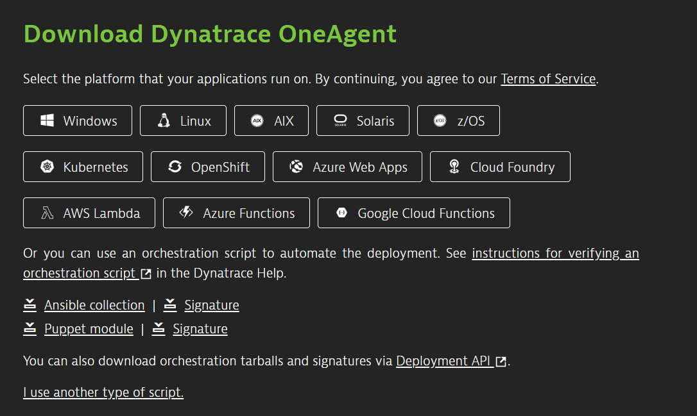

2. Once the OneAgent has installed, click on 'Show Deployment Status' and you should see your host in the list of OneAgent deployments as shown below:

    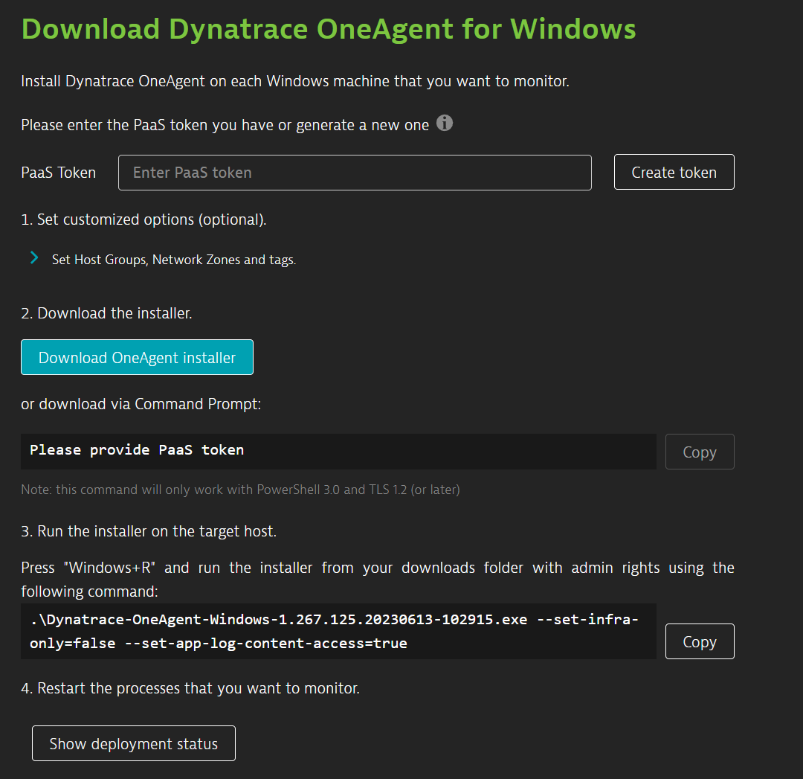

    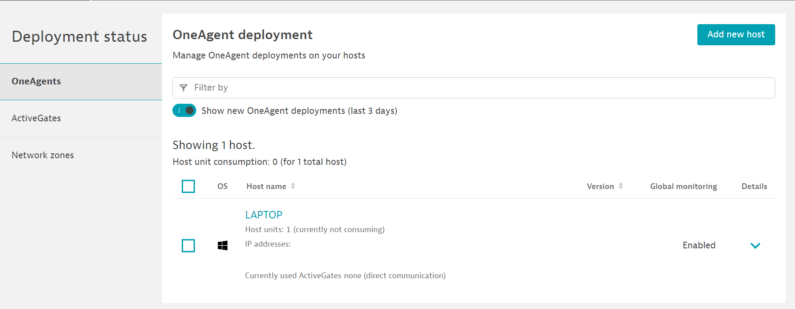

3. Next, if you click the host, you can see monitoring information about your host. Also, you can click 'Go to the classic page ' to see the old style view of information as shown below:

    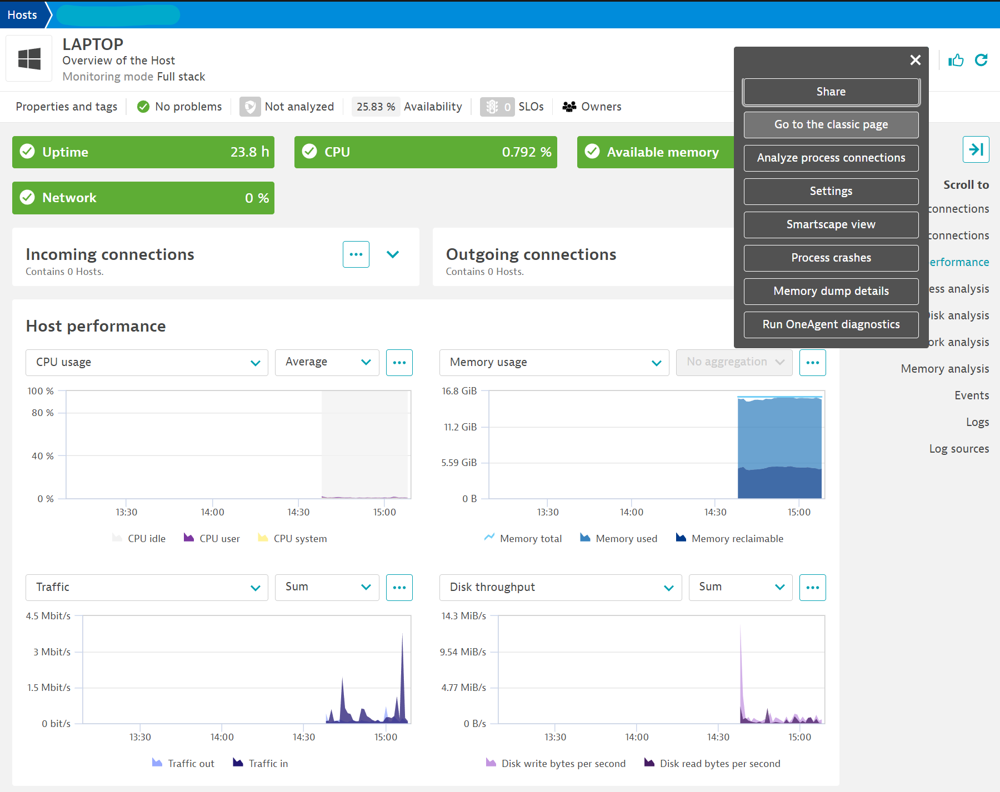

    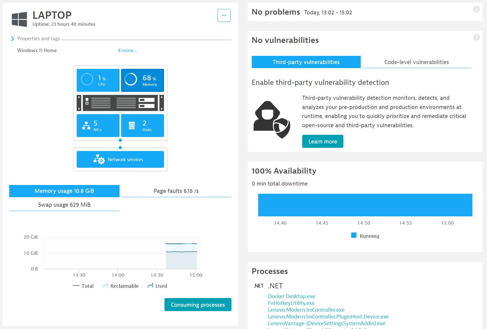

## Infrastructure Monitoring

### Problems Monitoring

Dynatrace is smart enough to group problems into one if the root cause is the same for all problems to easily see how to resolve problems with infrastructure.

Dynatrace will display the root cause application or process causing the issue and for how long over a time period. Therefore, it is easy to track a root cause of a problem using Dynatrace.

Types of Dynatrace Problems (more detail [here](https://www.dynatrace.com/support/help/platform/davis-ai/basics/events/event-types/resource-events)):

- Unexpected high traffic
- CPU saturation
- Memory saturation
- Low disk space
- Slow disk
- Low number of inodes available
- High network utilisation
- Long garbage-collection time
- High latency
- I/O commands queued
- Custom resource contention event

### Availability

You can see a percentage of availability which shows how much downtime (offline) or uptime (running) the machine has and at what time periods. It also shows the status of the host as the following types:

- Running: The host is running normally.

- Offline: Numerous reasons the host can be offline, such as the host simply being turned off, an issue with communication, it was shutdown unexpectedly or the host is so unstable that monitoring cannot be performed.

- Shutdown: Graceful and expected shutdown or reboot of host.

- Maintenance: You can schedule in a maintenance window so this does not affect this graph, and will appear as another metric instead of just displaying that the host is offline.

### Processes

You can click to see 'All processes' to view all the running processes and specific information regarding that process. It can help to cleanup processes and optimise your host machine.

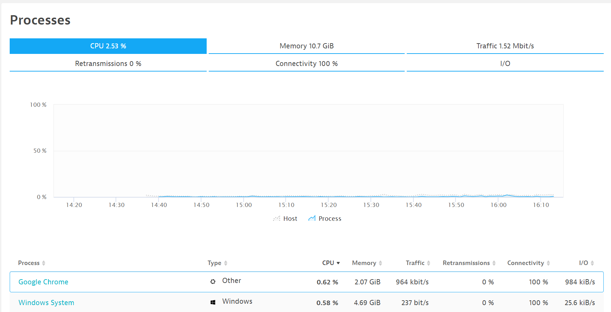

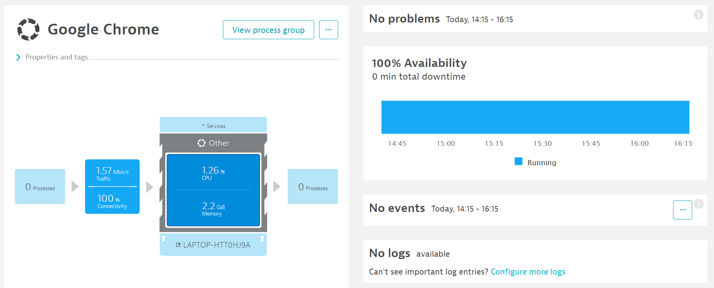

### Events

You can see all the host events to see when processes started, any issues or problems that occurred etc. It also allows you to see more detail of the event, for how long it took, which program or process that was involved with the event.

### Logs

To setup log monitoring go to the following:

> Settings > Monitored technologies > Log monitoring > Edit > Enable 'Monitor Log Monitoring on every host'

### Full Stack vs Infrastructure Only Monitoring

By default, Dynatrace will monitor the infrastructure and all applications and processes performance as well as user experience data. This is called 'Full-stack monitoring' and is enabled by default. To change it to 'Infrastructure only' monitoring which is less expensive, go to the following:  

> Settings > Monitoring > Monitoring Overview > Edit > Enable/disable 'Full-stack monitoring'

### Frequent Issues

If a problem or issue arises regularly, by default Dynatrace will label this as a 'Frequent issue' and will not flag it up in red or alert you anymore of this problem. To turn this feature off go to the following:

> Settings > Anomaly detection > Frequent issue detection > Disable 'Detect frequent issues within infrastructure'

### Naming

Dynatrace automatically names your hosts based on their DNS names as they are detected by Dynatrace OneAgent. You can manually change the name by going to the following:

> Host > Settings > Change 'Host name'

To set up a host naming rule and automatically change the host name, do the following:

> Settings > Monitoring > Host naming > Add a new rule > Enter 'Rule name', 'Host name format', 'groups and technologies' and 'conditions'

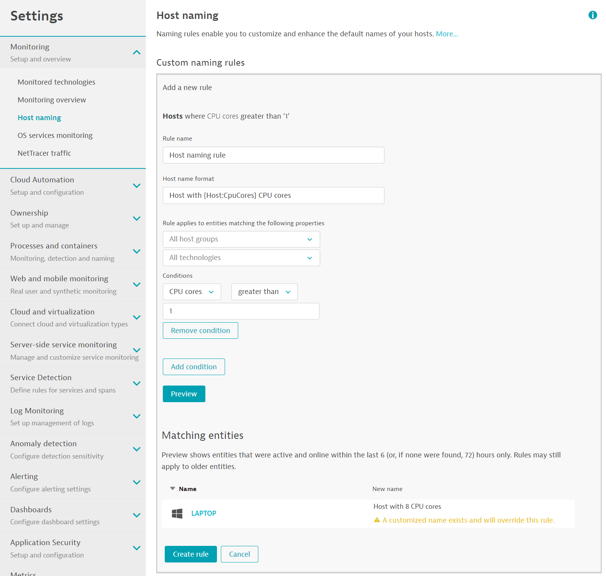

### Exclude Disk or Network traffic from Monitoring

You can exclude specific disks or network traffic from being monitored by going to the following settings for disk and network traffic respectively:

> Host > Settings > Disk options > Exclude disks > Add item > Specify your disk

> Host > Settings > Exclude network traffic > Add item for NIC or IP

## Cloud Automation

Test

## Applications and Microservices

For this section, we can use Dynatrace's demo applications to understand how the analyses work.

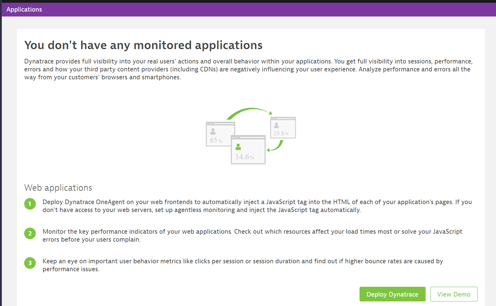

### Web Applications Performance Analysis

For a web application, we can gather many different metrics and types of analyses such as the following:

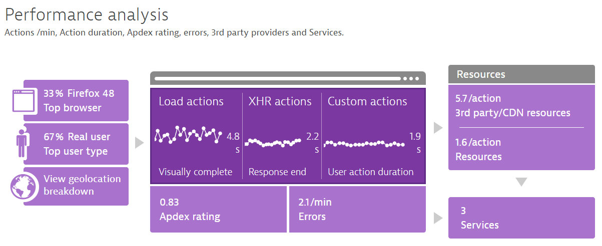

Types of browsers and devices, what is the most common type of device such as desktop or mobile and which browser type such as Google Chrome or Firefox etc.

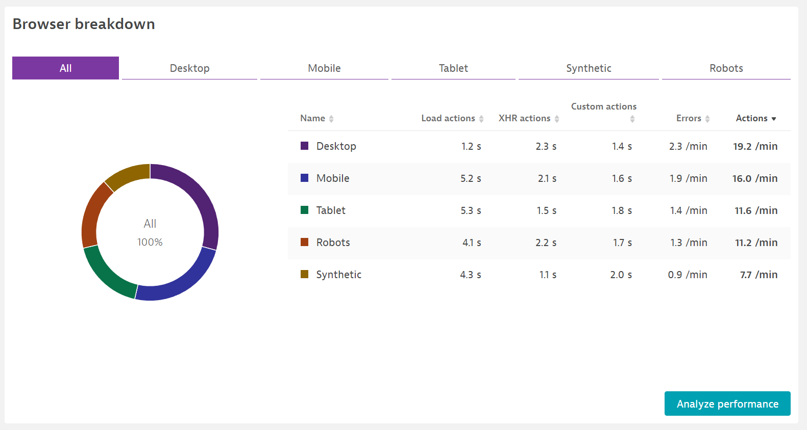

Types of users, if they are human or bots.

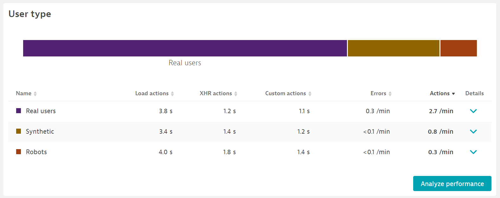

Geo-location breakdown, to show where the majority of the users are located to provide a better service for users.

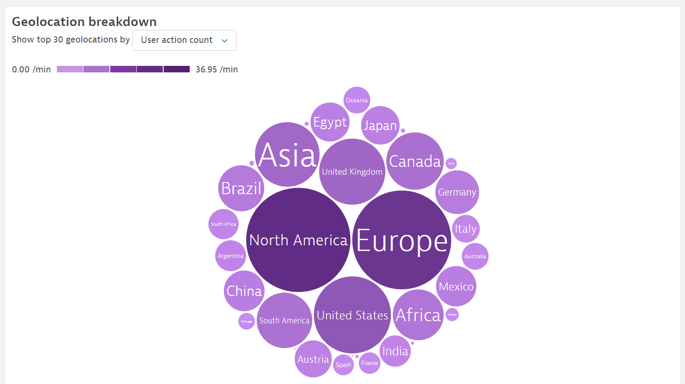

Load, XHR and Custom actions, showing how long it takes for a user to do a specific action on the web application.

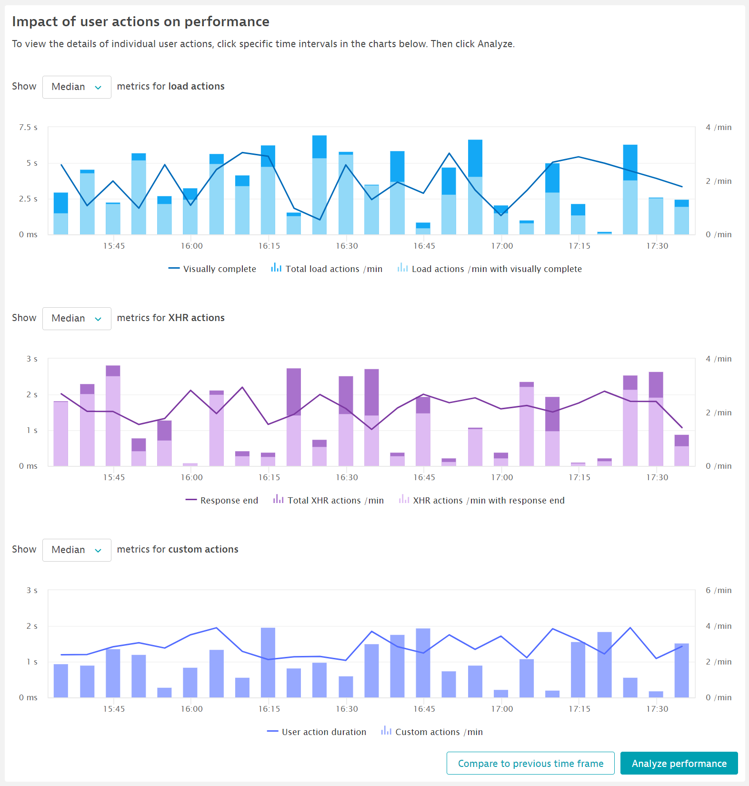

There are a range of other metrics you can analyse such as Apdex (Application performance index) rating, Errors, Services and Resources such as CDNs and 3rd party resources.

### Web Applications User Behaviour

In a similar way, we can also see many different user behaviour and experience data such as number of active sessions, top pages of the site, peak activity intervals, top bounces and top entry and exit actions.

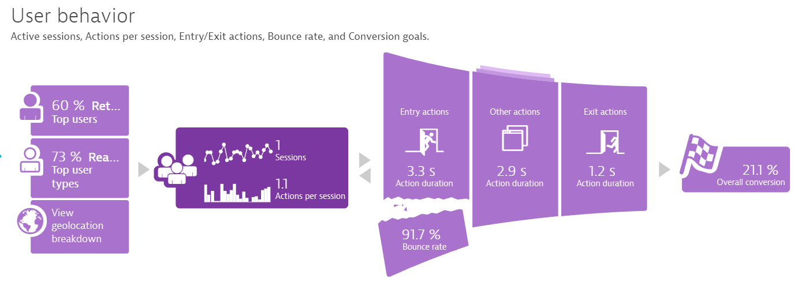

Active sessions showing the trend of activity of users and at which time there are most sessions and when are the users starting to use the application.

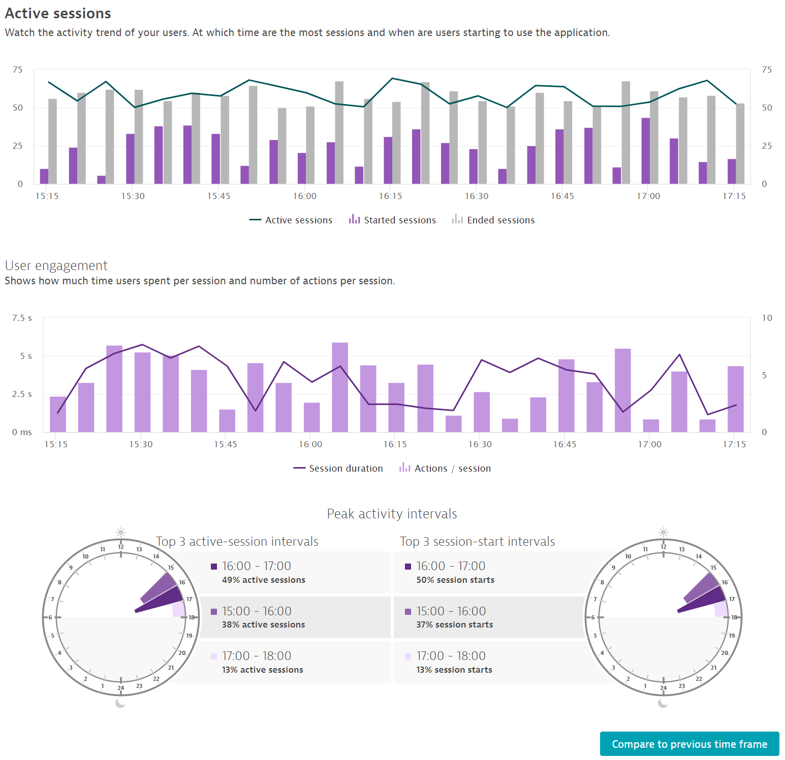

### Mobile Applications Metrics

Similar to web applications, you can see different metrics relating to user experience of a mobile application, the web requests, crashes and errors, data privacy and other information regarding the mobile application and its settings.
